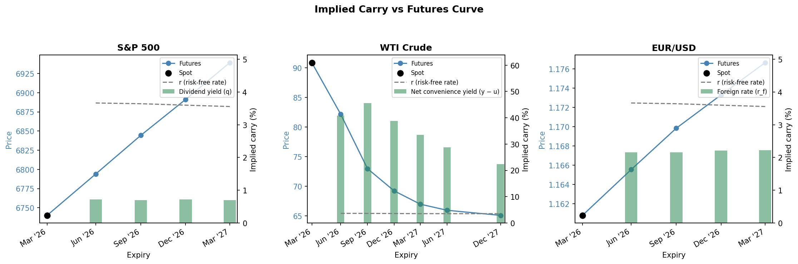

# Chapter 5 - Determination of Forward and Futures Prices

**Script:** `ch05_forward_futures_pricing/implied_carry_calculator.py`

Applies the cost-of-carry model described in Chapter 5 to three asset classes. For each futures contract, it fetches the live spot and futures prices, interpolates the risk-free rate from the bootstrapped Treasury zero curve (Chapter 4), and backs out the implied carry from `F = S · exp((r − carry) · T)`. Results are plotted as a futures price curve against time to expiry, with implied carry bars for each contract.

```bash
python ch05_forward_futures_pricing/implied_carry_calculator.py
```

---

## What it does

| Step | Detail |
|------|--------|
| Risk-free curve | Bootstrapped zero rates from FRED Treasury yields, imported from ch04 |
| Spot prices | Latest close from Yahoo Finance |
| Futures prices | Same, for each contract in `ASSETS` |
| Time to maturity | Derived from the ticker symbol; uses 15th of expiry month as approximation |
| Implied carry | `carry = r - ln(F/S) / T`, solved from the cost-of-carry equation |

---

## Assets

| Asset | Type | Spot ticker | Futures contracts |
|-------|------|-------------|-------------------|
| S&P 500 | Equity index | `^GSPC` | ESM/U/Z26.CME, ESH27.CME |
| WTI Crude | Commodity | `CL=F` (front-month proxy) | CLM/U/Z26.NYM, CLH/M/Z27.NYM |
| EUR/USD | Currency | `EURUSD=X` | 6EM/U/Z26.CME, 6EH27.CME |

WTI Crude uses the continuous front-month contract (`CL=F`) as a spot proxy since Yahoo Finance does not provide a direct commodity spot price. This is standard practice: for commodities, the nearest futures contract is the primary price discovery instrument.

Edit `ASSETS` at the top of the script to change assets, spot tickers, or futures contracts. Each entry requires a `name`, a `type` (controls the carry label in the chart), a `spot` ticker, and a `futures` list. The number of assets and contracts (with different maturity dates) per asset are both flexible.

---

## Carry interpretation by asset type

The **cost of carry** `b = r − carry` is the net annualized cost of holding the underlying: financing cost `r` minus the implied income rate (`carry`). The model `F = S · exp(b · T)` prices futures accordingly. So, what we call **carry** is the income side, the benefit of holding the asset between now and the maturity date of the futures contract, expressed as a continuously compounded annual rate (same convention as `r`), implied by current spot and futures prices under no-arbitrage.

The meaning of carry differs by asset type:

| Asset type | carry = | Interpretation |
|------------|---------|----------------|
| Equity index | q | Implied dividend yield |
| Commodity | y − u | Net convenience yield (convenience yield minus storage costs) |
| Currency | r_f | Foreign risk-free rate (covered interest rate parity) |

---

## Futures ticker format

```
ROOT + MONTH_LETTER + TWO_DIGIT_YEAR + .EXCHANGE
```

| Month | Code | | Exchange | Code |
|-------|------|-|----------|------|
| January | F | | CME (S&P, EUR) | `.CME` |
| February | G | | NYMEX (crude oil) | `.NYM` |
| March | H | | | |
| April | J | | | |
| May | K | | | |
| June | M | | | |
| July | N | | | |
| August | Q | | | |
| September | U | | | |
| October | V | | | |
| November | X | | | |
| December | Z | | | |

---

## Output

### Console

```
S&P 500 (spot = $6740.0200)
  Jun 2026 contract: ESM26.CME  F = $6794.0000  T = 0.27Y  r = 3.66%  carry = 0.72%
  Sep 2026 contract: ESU26.CME  F = $6844.5000  T = 0.52Y  r = 3.64%  carry = 0.70%
  Dec 2026 contract: ESZ26.CME  F = $6891.2500  T = 0.77Y  r = 3.60%  carry = 0.72%
  Mar 2027 contract: ESH27.CME  F = $6939.2500  T = 1.02Y  r = 3.56%  carry = 0.70%

WTI Crude (spot = $90.9000)
  Jun 2026 contract: CLM26.NYM  F = $82.1900  T = 0.27Y  r = 3.66%  carry = 40.83%
  Sep 2026 contract: CLU26.NYM  F = $72.9800  T = 0.52Y  r = 3.64%  carry = 45.63%
  Dec 2026 contract: CLZ26.NYM  F = $69.2400  T = 0.77Y  r = 3.60%  carry = 38.85%
  Mar 2027 contract: CLH27.NYM  F = $66.9800  T = 1.02Y  r = 3.56%  carry = 33.54%
  Jun 2027 contract: CLM27.NYM  F = $65.9500  T = 1.27Y  r = 3.55%  carry = 28.81%
  Dec 2027 contract: CLZ27.NYM  F = $65.0900  T = 1.77Y  r = 3.54%  carry = 22.40%

EUR/USD (spot = $1.1608)
  Jun 2026 contract: 6EM26.CME  F = $1.1655  T = 0.27Y  r = 3.66%  carry = 2.16%
  Sep 2026 contract: 6EU26.CME  F = $1.1698  T = 0.52Y  r = 3.64%  carry = 2.16%
  Dec 2026 contract: 6EZ26.CME  F = $1.1733  T = 0.77Y  r = 3.60%  carry = 2.21%
  Mar 2027 contract: 6EH27.CME  F = $1.1767  T = 1.02Y  r = 3.56%  carry = 2.23%
```

### Chart

One subplot per asset. Left axis: spot (black dot) and futures price curve. Right axis: implied carry bars with the risk-free rate for reference.

- S&P 500: gentle upward slope (contango), carry ~0.7% = implied dividend yield, well below r
- WTI Crude: steep downward slope (strong backwardation), carry ~23-46% = net convenience yield far exceeding storage costs, declining at later expiries as the supply premium fades (the example was run on March 8th 2026, in a context of geopolitical shock with the conflict in Iran)
- EUR/USD: gentle upward slope, carry ~2.2% = implied EUR rate, consistent with covered interest rate parity


