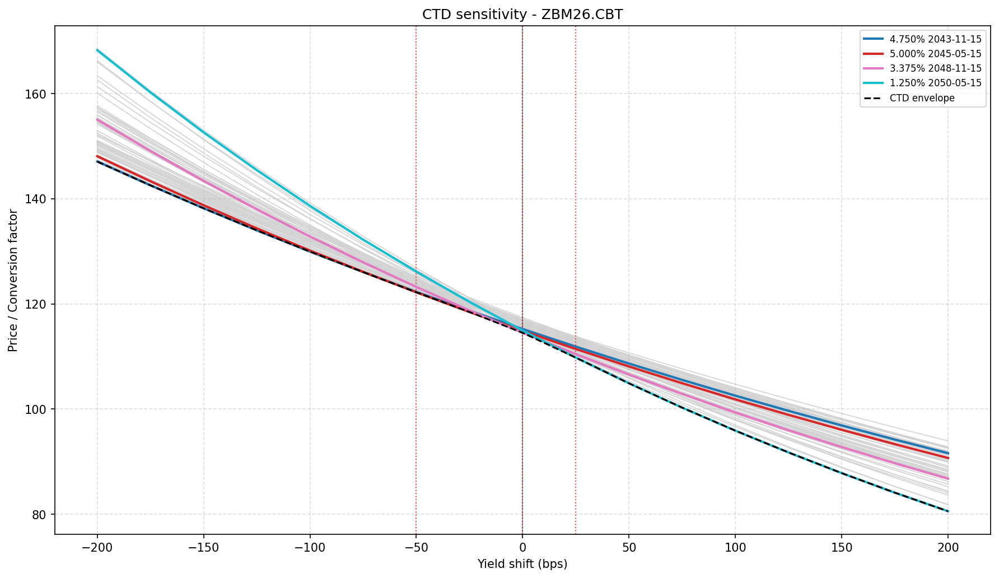

# Chapter 6 - Interest Rate Futures

**Script:** `ch06_interest_rate_futures/ctd_bond_finder.py`

Identifies the cheapest-to-deliver (CTD) bond for a CME T-bond futures contract. Reads the deliverable basket and conversion factors from the official CME spreadsheet, prices each bond using the bootstrapped Treasury zero curve from Chapter 4 (as a forward curve to the delivery date), and ranks bonds by delivery cost. Includes a parallel yield curve sensitivity analysis showing how the CTD changes across a -200bp to +200bp shift range.

```bash
python ch06_interest_rate_futures/ctd_bond_finder.py
```

---

## What it does

| Step | Detail |
|------|--------|
| Deliverable basket | Parsed from CME TCF.xlsx (download link in script); section and delivery month located dynamically |
| Conversion factors | Read from the same spreadsheet, per delivery month column |
| Zero curve | Bootstrapped from FRED Treasury yields, imported from ch04 |
| Forward curve | Derived from the spot zero curve for the delivery date: `r_fwd(t) = (r_spot(t0+t)*(t0+t) - r_spot(t0)*t0) / t` |
| Bond pricing | Dirty price from discounted semi-annual cash flows; accrued interest subtracted (Actual/Actual) |
| Delivery cost | `quoted price - futures price * conversion factor`; CTD minimises this |
| Sensitivity | Parallel shift of spot curve from -200bp to +200bp in 25bp steps; forward curve rebuilt at each level |

---

## Parameters

Edit these constants at the top of the script:

| Constant | Default | Description |
|----------|---------|-------------|
| `SECTION_HEADER` | `"U.S. TREASURY BOND FUTURES CONTRACT"` | Selects ZB (30-year). Commented alternatives for TWE (20-year) and UB (ultra) |
| `DELIVERY_DATE` | `date(2026, 6, 1)` | First day of the delivery month |
| `TICKER` | `"ZBM26.CBT"` | Yahoo Finance ticker for the futures price |
| `FACE` | `100` | Pricing convention (per $100 face; actual bond face is $100k) |

The TCF.xlsx file must be placed in the same folder as the script. Download from:
https://www.cmegroup.com/trading/interest-rates/treasury-conversion-factors.html

---

## Output

### Console

```
CTD bond: 3.375% 2048-11-15 | Price: 77.8499 | CF: 0.6799 | Delivery cost: -0.2323

Coupon    Maturity      Price        CF   Del. cost  CUSIP
-------------------------------------------------------------
3.375%    2048-11-15   77.8499    0.6799     -0.2323  912810SE9 <-- CTD
3.125%    2048-05-15   74.8383    0.6532     -0.1777  912810SC3
2.875%    2049-05-15   70.4353    0.6148     -0.1706  912810SH2
2.750%    2047-11-15   70.2245    0.6125     -0.1173  912810RZ3
2.375%    2049-11-15   62.8914    0.5486     -0.1119  912810SK5
...

CTD by yield shift:
Shift     Coupon    Maturity    CUSIP
------------------------------------------
-200bp    4.750%    2043-11-15  912810TW8
-175bp    4.750%    2043-11-15  912810TW8
-150bp    4.750%    2043-11-15  912810TW8
-125bp    4.750%    2043-11-15  912810TW8
-100bp    4.750%    2043-11-15  912810TW8
-75bp     4.750%    2043-11-15  912810TW8
-50bp     5.000%    2045-05-15  912810UL0  <-- switch
-25bp     5.000%    2045-05-15  912810UL0
+0bp      3.375%    2048-11-15  912810SE9  <-- switch
+25bp     1.250%    2050-05-15  912810SN9  <-- switch
+50bp     1.250%    2050-05-15  912810SN9
+75bp     1.250%    2050-05-15  912810SN9
+100bp    1.250%    2050-05-15  912810SN9
+125bp    1.250%    2050-05-15  912810SN9
+150bp    1.250%    2050-05-15  912810SN9
+175bp    1.250%    2050-05-15  912810SN9
+200bp    1.250%    2050-05-15  912810SN9
```

### Chart

One plot showing price/CF for all 59 bonds across yield shifts. Non-CTD bonds are grey; bonds that are CTD at any point are highlighted in colour. The dashed black line traces the CTD envelope (lower bound). Red dotted vertical lines mark each CTD switch point; the thin black vertical line marks the current yield level (shift = 0).

The chart is consistent with Hull's remarks in Chapter 6: when yields are low (curve shifted down), high-coupon short-maturity bonds become CTD; when yields are high, low-coupon long-maturity bonds tend to claim the spot.


