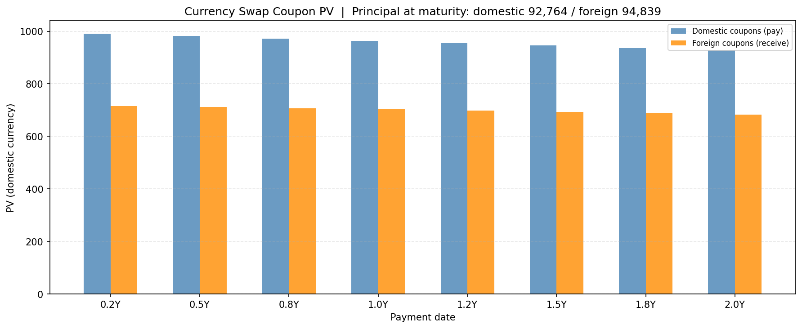
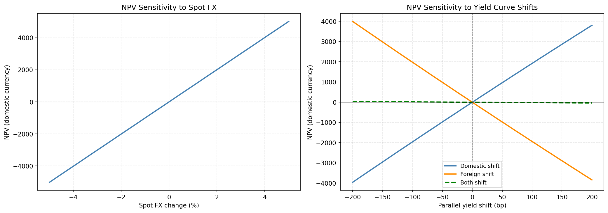

# Chapter 7 - Swaps

**Script:** `ch07_swaps/currency_swap_pricer.py`

Prices a cross-currency swap (fixed-for-fixed or fixed-for-floating) by bootstrapping domestic (USD) and foreign zero curves from live market data to discount future cash flows of each leg. The foreign zero curve is derived from FX futures via covered interest parity, reusing the yield curve from Chapter 4 and the FX futures logic from Chapter 5. Solves for the fair fixed rate on either leg, then runs FX and interest rate sensitivity analysis.

```bash
python ch07_swaps/currency_swap_pricer.py
```

---

## What it does

| Step | Detail |
|------|--------|
| USD zero curve | Bootstrapped from FRED Treasury yields (imported from ch04), interpolated with cubic spline |
| Foreign zero curve | Derived from FX futures via covered interest parity. Starting from `F = S * exp((r_domestic - r_foreign) * T)`, solving for the foreign rate gives `r_foreign(T) = r_USD(T) - ln(F/S) / T`. Each FX futures contract gives one foreign zero rate at its expiry date |
| Spot FX | Fetched from Yahoo Finance (imported from ch05) |
| Leg valuation | Fixed leg: discounted coupons + principal. Floating leg: each coupon set to the forward rate implied by the zero curve over that period |
| Fair rate | Brent's method solves for the fixed rate that makes NPV = 0 at inception of the swap. Can solve for either the domestic or foreign leg |
| FX sensitivity | NPV across spot FX shocks of -5% to +5% |
| Rate sensitivity | NPV across parallel yield curve shifts of -200bp to +200bp. Three scenarios: domestic shift only, foreign shift only, both |

---

## Parameters

Edit these constants at the top of the script:

| Constant | Default | Description |
|----------|---------|-------------|
| `FOREIGN_SPOT_TICKER` | `"EURUSD=X"` | Yahoo Finance spot FX ticker |
| `FOREIGN_FUTURES_TICKERS` | `["6EM26.CME", ...]` | CME FX futures tickers, quarterly out to ~2Y |
| `DOMESTIC_NOTIONAL` | `100_000` | Domestic (USD) notional. Set one notional, leave the other as `None` |
| `FOREIGN_NOTIONAL` | `None` | Foreign notional. The missing one is derived from spot FX at runtime |
| `MATURITY` | `2` | Swap maturity in years |
| `FREQUENCY` | `4` | Coupon payments per year |
| `DOMESTIC_RATE` | `0.04` | Fixed rate on the domestic (USD) leg |
| `DOMESTIC_LEG_TYPE` | `"fixed"` | `"fixed"` or `"floating"` |
| `FOREIGN_RATE` | `None` | Fixed rate on the foreign leg (`None` = solve for it) |
| `FOREIGN_LEG_TYPE` | `"fixed"` | `"fixed"` or `"floating"` |
| `SOLVE_FOR` | `"foreign"` | Which leg's fair rate to solve for (`"domestic"` or `"foreign"`) |

To price a different currency pair, change `FOREIGN_SPOT_TICKER` and `FOREIGN_FUTURES_TICKERS` to match the relevant Yahoo Finance tickers.

---

## Output

### Console

```
Fetching US Treasury yields from FRED...
  DGS1MO   ( 0.083Y): 3.73%
  DGS3MO   ( 0.250Y): 3.73%
  ...

Spot FX (EURUSD=X): 1.1575
  Jun 2026  T=0.24Y  F=1.1596  r_USD=3.694%  r_foreign=2.921%
  Sep 2026  T=0.49Y  F=1.1636  r_USD=3.724%  r_foreign=2.653%
  Dec 2026  T=0.74Y  F=1.1671  r_USD=3.719%  r_foreign=2.609%
  Mar 2027  T=0.98Y  F=1.1704  r_USD=3.696%  r_foreign=2.573%
  Jun 2027  T=1.23Y  F=1.1736  r_USD=3.693%  r_foreign=2.577%
  Sep 2027  T=1.49Y  F=1.1765  r_USD=3.709%  r_foreign=2.619%
  Dec 2027  T=1.74Y  F=1.1794  r_USD=3.733%  r_foreign=2.658%

Fair foreign fixed rate: 2.8736%
```

The foreign zero rates (~2.6-2.9%) sit roughly 100bp below USD rates (~3.7%), reflecting the interest rate differential between the Fed and ECB. The fair foreign fixed rate of 2.87% lands in the range of the foreign zero rates, as expected for a par swap rate.

### Charts

Coupon PV comparison for both legs. Principal amounts are shown in the title rather than as bars, since at $100k notional the principal PV dwarfs the coupon PVs and compresses the chart scale.



FX sensitivity (left) shows the linear relationship between spot FX moves and swap MtM. Rate sensitivity (right) shows NPV response to parallel shifts in each curve independently and together.



---

## Notes

- **Day count conventions ignored.** In practice, swap coupons are computed using day count fractions (Actual/360 for USD floating, 30/360 for USD fixed, Actual/365 for GBP, etc.). This script assumes every payment period is exactly `1/frequency` years. The pricing error is small on a 2Y swap (a few basis points at most) and Hull uses the same simplification for this chapter's numerical examples.
- **Maturity capped at ~2 years.** The foreign zero curve is built from CME FX futures, which are liquid quarterly out to about 2 years. Beyond that, open interest drops sharply (unreliable to use as data) and Yahoo Finance often returns missing prices (crashes the script). Extending to longer maturities would require bootstrapping from ECB yield curve data or EUR swap quotes (for EUR only, so it would lose the flexibility of choosing the currency by switching tickers), which would add complexity without new conceptual insight.
- **No initial principal exchange modelled.** At inception, both parties exchange notional at the current spot rate. By definition both sides are worth the same, so the initial exchange contributes zero to NPV. Only the coupon streams and the final principal re-exchange drive the swap's value and are accounted for.
- **Treasury rates used as risk-free proxy.** Both the domestic curve (from FRED Treasuries) and the foreign curve (derived via covered interest parity from those same rates) use Treasury yields rather than OIS rates. For pedagogical purposes this is appropriate; the mechanics are identical, and the OIS/Treasury spread is small.