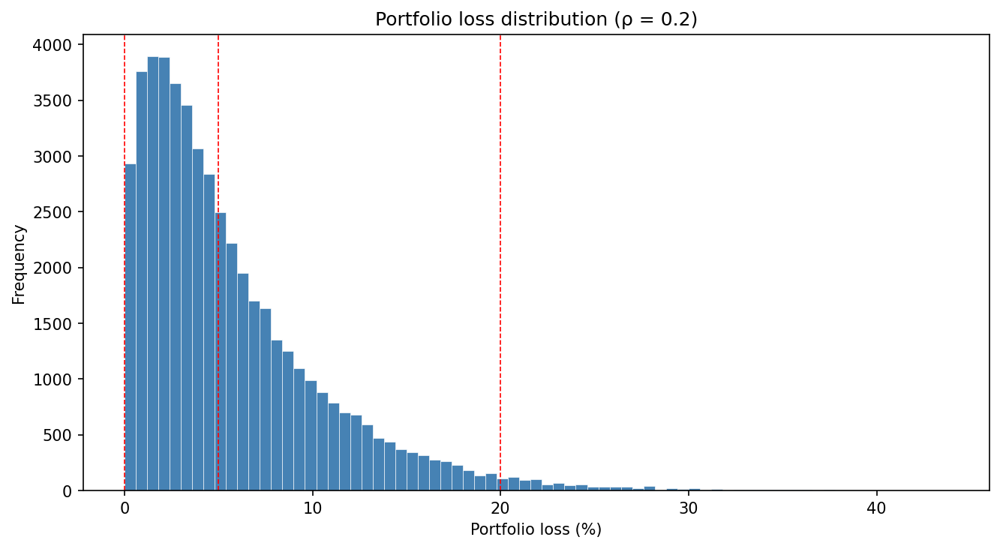
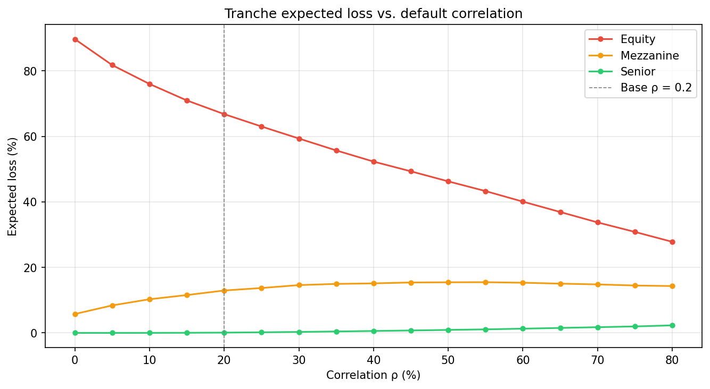

# Chapter 8: Securitization and the Financial Crisis of 2007–8

Prices CDO tranches using a one-factor Gaussian copula model with Monte Carlo simulation. Derives default probability from real credit spread data (FRED), simulates defaults across a loan portfolio, allocates losses to different tranches through a waterfall structure by order of seniority, and shows how tranche risk shifts as default correlation changes.

## How it works

| Step | What it does |
|------|-------------|
| Fetch credit spread | Pulls the latest BBB corporate bond spread from FRED (ICE BofA index) |
| Derive default probability | Converts the spread to a cumulative default probability using the credit triangle |
| Simulate defaults | Generates correlated default outcomes via the Gaussian copula (50,000 scenarios) |
| Allocate losses | Runs portfolio losses through the tranche waterfall |
| Fair spreads | Computes the annualized premium each tranche would require |
| Correlation sensitivity | Sweeps correlation from 0% to 80% and re-runs the simulation at each level |

## Background

A CDO (collateralized debt obligation) pools together a portfolio of credit-risky assets (loans, bonds, or CDS) and slices the combined cash flows into tranches with different seniority. Losses hit the equity tranche first, then mezzanine, then senior. This means the senior tranche is protected by the subordination of everything below it, while the equity tranche absorbs the first losses and is compensated with a higher spread.

The key question is: how much loss should each tranche expect? That depends on how many credits default, which in turn depends on how correlated their defaults are.

### The one-factor Gaussian copula

We know each credit's individual probability of defaulting (its marginal PD), but that tells us nothing about whether they tend to default together or independently. A **copula** is the function that fills this gap: it takes individual default probabilities and joins them into a joint distribution with a specified dependence structure, without changing each credit's marginal PD.

The **Gaussian copula** assumes that the dependence between credits can be modeled as if their default drivers were jointly normal. In the one-factor version used here, each credit's default driver *Xᵢ* is a weighted sum of two independent standard normal draws:

```
Xᵢ = √ρ · M + √(1 − ρ) · Zᵢ
```

- *M* is a common market factor, shared by all credits. It represents the state of the economy.
- *Zᵢ* is an idiosyncratic factor, specific to credit *i*. It represents that credit's individual circumstances.
- *ρ* controls the balance: when *ρ* is high, the common factor dominates and credits move together. When *ρ* is low, each credit's fate is mostly its own.

Credit *i* defaults when *Xᵢ* falls below a threshold. Since *Xᵢ* is standard normal, the threshold is chosen so that *P(Xᵢ < a) = PD*, which gives *a = Φ⁻¹(PD)*. This guarantees each credit's marginal default probability matches the input PD, regardless of correlation. When *ρ = 0*, defaults are fully independent. When *ρ = 1*, all credits default together or none do.

### Default probability from credit spreads

The script fetches the BBB option-adjusted spread from FRED (`BAMLC0A4CBBB`). This spread represents the excess yield investors demand over Treasuries for holding BBB-rated corporate bonds. The credit triangle approximation converts it to a default probability:

```
PD_annual = s / (1 − R)
PD_cumulative = 1 − (1 − PD_annual)ᵀ
```

where *s* is the credit spread and *R* is the recovery rate. This is explained by the fact that the spread compensates for expected loss, which equals the probability of default times the loss given default *(1 − R)*. Solving for PD gives the formula above. The cumulative PD assumes independence across years.

### Tranche loss allocation (the waterfall)

Each tranche is defined by an attachment point and a detachment point. For a given portfolio loss `L`:

```
tranche_loss = min(max(L - attachment, 0), width) / width
```

where `width = detachment - attachment`. Losses below the attachment point don't touch the tranche. Losses above the detachment point are fully absorbed (100% loss for that tranche) and overflow to the next one. The expected loss is the average tranche loss across all simulated scenarios.

### Fair spread

The annualized fair spread for each tranche is:

```
fair_spread = expected_loss / maturity
```

This is a simplified calculation. It assumes the protection leg and the premium leg have the same effective duration. A full model would discount both legs and account for the fact that premiums stop when the tranche is wiped out (risky annuity adjustment). The simplification is standard for pedagogical purposes and produces spreads that are directionally correct and comparable across tranches.

## How to run

```
python ch08_securitization/cdo_tranche_pricer.py
```

Requires a FRED API key stored in a `.env` file at the project root:

```
FRED_API_KEY=your_key_here
```

Free keys are available at [fred.stlouisfed.org](https://fred.stlouisfed.org).

---

## Parameters

| Constant | Default | Description |
|----------|---------|-------------|
| `N_CREDITS` | 100 | Number of credits in the portfolio |
| `RECOVERY_RATE` | 0.40 | Fraction of face value recovered on default |
| `CORRELATION` | 0.20 | Pairwise default correlation (Gaussian copula rho) |
| `MATURITY` | 5 | Portfolio horizon in years |
| `N_SIMULATIONS` | 50,000 | Number of Monte Carlo scenarios |
| `TRANCHES` | Equity 0-5%, Mezzanine 5-20%, Senior 20-100% | Tranche attachment and detachment points |
| `CREDIT_SPREAD_SERIES` | `BAMLC0A4CBBB` | FRED series ID for the credit spread |

---

## Example output

```
Credit spread (BBB):  1.11%
Implied annual PD:    1.85%
Cumulative PD (5Y):   8.91%

Simulation (50,000 scenarios):
Mean portfolio loss:  5.34%
Max portfolio loss:   45.60%
P(any default):       94.0%

Tranche expected losses:
Equity         66.75%
Mezzanine      12.85%
Senior         0.10%

Fair spreads (annualized):
Equity         1335 bps
Mezzanine      257 bps
Senior         2 bps
```

## Charts

### Portfolio loss distribution

Histogram of portfolio losses across 50,000 simulated scenarios. Red dashed lines mark tranche attachment points.



### Correlation sensitivity

Expected loss for each tranche as default correlation varies from 0% to 80%.

At low correlation, defaults are roughly independent and spread out. The equity tranche absorbs most of the expected loss, and senior tranches are nearly untouched. As correlation increases, defaults cluster: either very few credits default (good for equity) or many default at once (very bad for senior). The equity tranche expected loss actually decreases because the "no defaults" scenario becomes more likely. The senior tranche expected loss increases because the clustered-default scenarios now breach its attachment point.



---

## Notes

- **Homogeneous pool.** All credits share the same default probability, recovery rate, and pairwise correlation. Real CDO pools contain credits of varying quality. The homogeneous assumption isolates the effect of correlation, which is the focus of this project.
- **Gaussian copula limitations.** The normal distribution has thin tails, meaning extreme joint defaults are less likely than in reality. Fat-tailed alternatives (like the Student-t copula) better capture systemic risk. The Gaussian copula correctly shows how correlation redistributes risk across tranches, but underestimates the absolute probability of extreme outcomes.
- **No default timing.** The simulation determines whether each credit defaults over the full horizon, but not when. This means the fair spread calculation cannot discount cash flows or adjust for early termination of premium payments (the risky annuity), and as a result they are only approximations.
- **Credit triangle approximation.** The formula *PD = s / (1 − R)* assumes the spread is entirely compensation for expected default loss. In practice, credit spreads also include a liquidity premium and a risk premium for bearing default uncertainty, so the implied PD is more of an upper bound, although most likely quite close.
- **Recovery rate is fixed.** The 40% assumption is the standard for senior unsecured corporate debt (historical average from Moody's). In practice, recovery rates vary by seniority, sector, and market conditions, and tend to be lower during recessions precisely when defaults spike.
